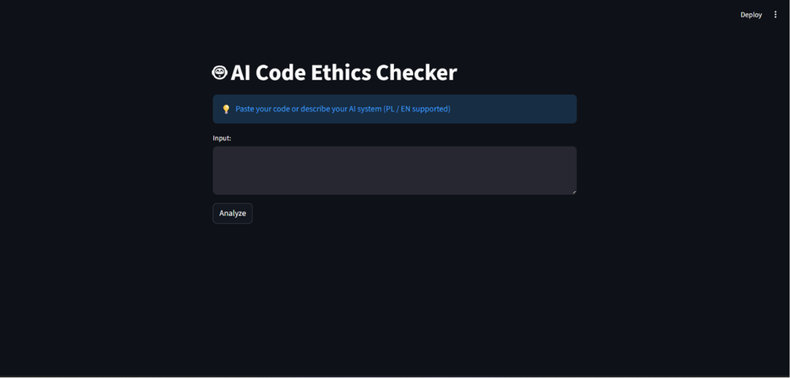
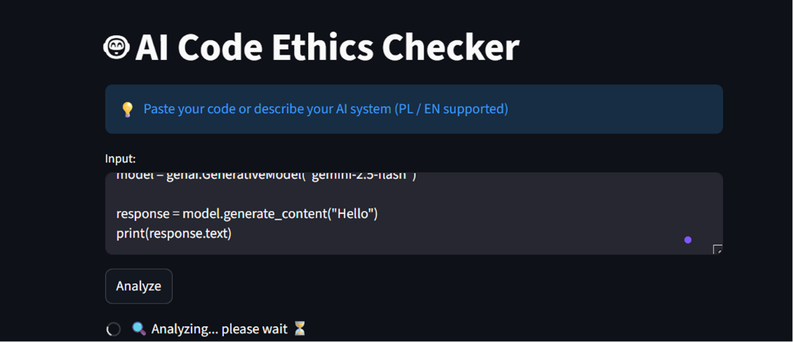
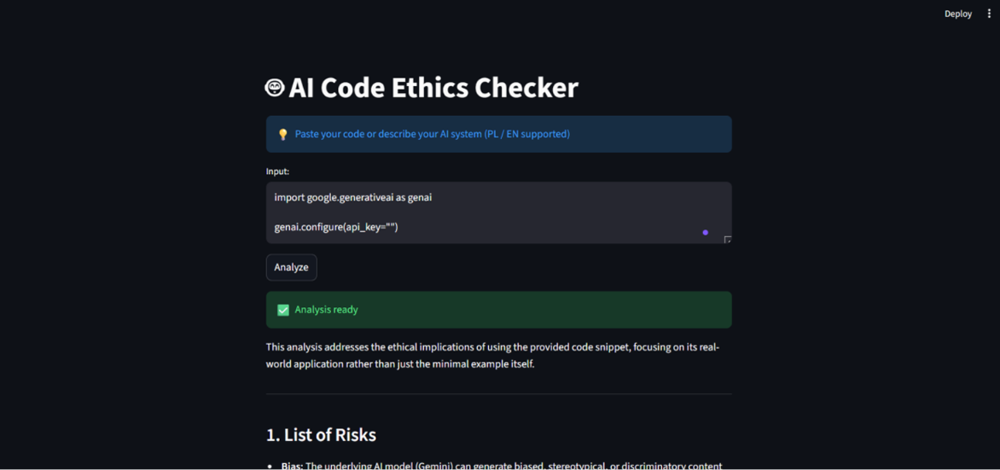
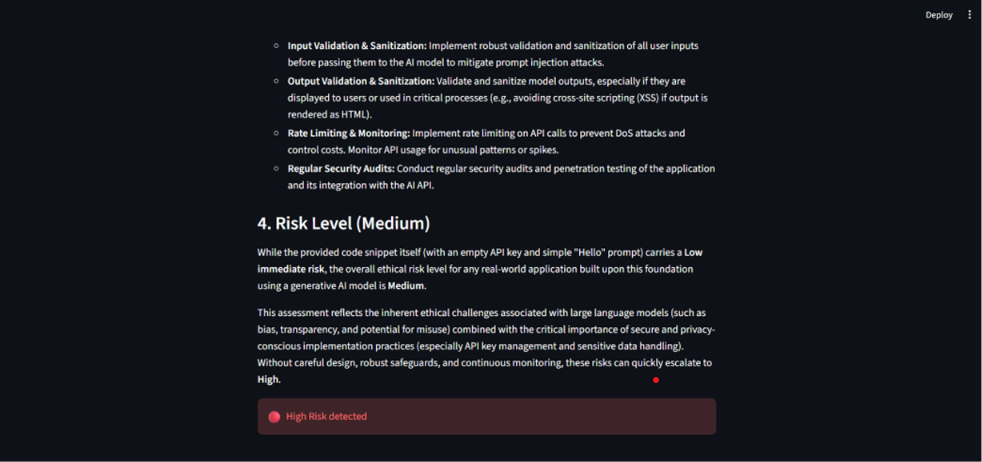

# AI Code Ethics Checker

## 1. Problem etyczny

Współczesne systemy informatyczne coraz częściej wykorzystują sztuczną inteligencję, jednak programiści i użytkownicy często nie są świadomi potencjalnych zagrożeń etycznych związanych z ich użyciem. Problemy takie jak stronniczość algorytmów (bias), naruszenie prywatności danych, brak przejrzystości działania modeli czy ryzyko manipulacji stanowią istotne wyzwania.

Brak odpowiedniej analizy etycznej może prowadzić do poważnych konsekwencji, takich jak dyskryminacja użytkowników, wyciek danych lub podejmowanie nieodpowiedzialnych decyzji technologicznych.

---

## 2. Użytkownik narzędzia

Narzędzie skierowane jest głównie do:
- programistów  
- studentów informatyki  
- zespołów technologicznych  

Użytkownik chce sprawdzić, czy jego kod lub pomysł na system AI jest etyczny oraz jakie potencjalne zagrożenia mogą z nim wiązać.

---

## 3. Opis narzędzia

Narzędzie „AI Code Ethics Checker” analizuje kod lub opis systemu pod kątem etycznym.

### Schemat działania:

**Input:**  
Użytkownik wprowadza kod lub opis systemu.

**Logika (AI):**  
Model AI (Gemini) analizuje dane i identyfikuje ryzyka.

**Output:**  
Raport zawiera:
- listę ryzyk  
- wyjaśnienia  
- rekomendacje  
- poziom ryzyka  

---

## 4. Uzasadnienie techniczne

Do realizacji projektu wykorzystano model Gemini od Google.

Zalety:
- łatwy dostęp (API)
- wysoka jakość analizy
- szczegółowe odpowiedzi

Ograniczenia:
- limity API  
- brak pełnej transparentności  
- możliwość błędów  

---

## 5. Analiza etyczna narzędzia

Narzędzie również może generować ryzyka:
- błędne analizy  
- bias modelu  
- nadmierne zaufanie użytkownika  

Minimalizacja ryzyk:
- struktura odpowiedzi  
- informowanie o poziomie ryzyka  
- traktowanie wyniku jako wsparcia  

---

## 6. Odniesienie do AI Act

Narzędzie można zaklasyfikować jako system niskiego ryzyka, ponieważ:
- nie podejmuje decyzji automatycznych  
- nie wpływa bezpośrednio na życie użytkownika  
- pełni funkcję doradczą  

Obowiązki:
- transparentność  
- informowanie o AI  
- unikanie wprowadzania w błąd  

---

## 7. Wnioski i ograniczenia

### Zalety:
- szybka analiza  
- łatwość użycia  
- wsparcie decyzji  

### Ograniczenia:
- zależność od modelu AI  
- brak pełnej dokładności  
- limity API  

### Możliwe ulepszenia:
- eksport PDF  
- lepsza analiza kodu  
- integracja z repozytoriami  

---

## 8. Interfejs aplikacji

### Rys. 1 – Interfejs użytkownika

---

### Rys. 2 – Wprowadzanie danych

---

### Rys. 3 – Wynik analizy

---

### Rys. 4 – Poziom ryzyka

